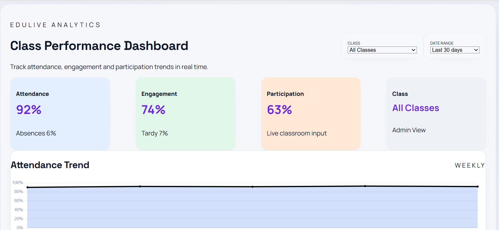
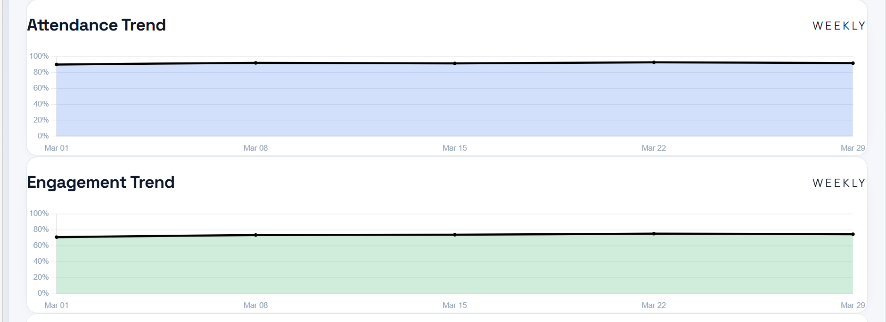
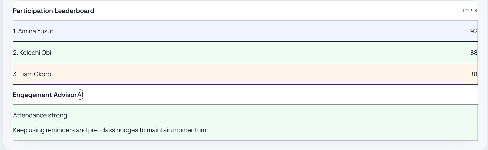
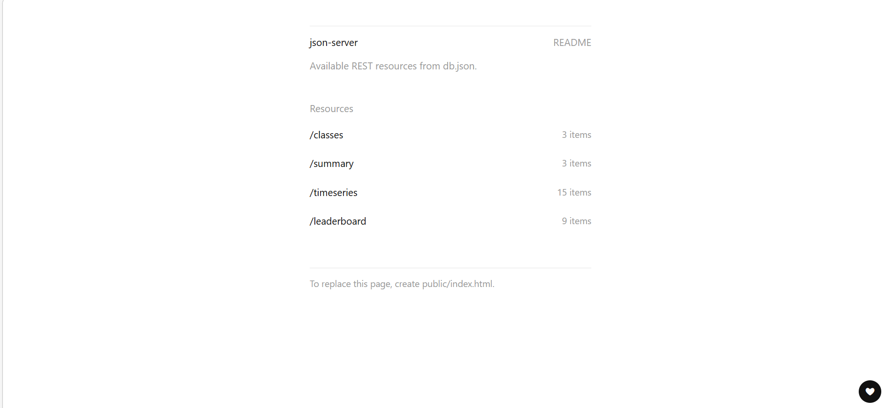

# EduLive Analytics Dashboard

A data-driven classroom analytics dashboard that visualizes student attendance, participation and engagement trends. Built with React, this application helps educators make informed decisions using real-time insights and AI-powered recommendations.

---

## Project Goal

To develop an interactive dashboard that tracks classroom performance and provides actionable insights into student engagement.

---

## Live Project

https://edulive-analytics-dashboard.vercel.app/

---

## Target Audience
- Teachers
- School administrators
- Educational institutions

---

## Features

**Analytics Dashboard**
- Attendance and engagement charts
- Participation trends visualization
- Color-coded metric cards

**Participation Leaderboard**
- Displays top-performing students
- Highlights engagement levels
  
**Filters**
- Filter data by class
- Filter data by date range
  
**Real-Time Data (Mocked)**
- Simulated API data using mock JSON
- Dynamic updates across components
  
**AI Engagement Advisor**
- Detects low participation trends
- Suggests actions to improve engagement
- Rule-based recommendation system
  
**Responsive Design**
- Optimized for desktop and mobile
- Clean and modern UI

---

## Tech Stack
- Frontend: React (Vite)
- Styling: Tailwind CSS
- Charts: Chart.js
- State Management: Context API
- Data Fetching: Axios
- Mock API: JSON Server
- Deployment: Vercel

---

## Screenshots

| Dashboard Overview | Charts |
|-------------------|--------|
|  |  |

| Leaderboard & AI-Advisor | JSON-Server |
|-------------|---------|
|  |  |

---

## Presentation Slides

https://github.com/MisturaDev/edulive-analytics-dashboard/blob/main/presentation/edulive-analytics-dashboard.pdf

---

## Colour Palette

https://github.com/MisturaDev/edulive-analytics-dashboard/blob/main/COLOR-PALETTE.md

---

## Installation & Setup
 1. Clone the repository
    ```bash
    git clone https://github.com/MisturaDev/edulive-analytics-dashboard.git

 2. Navigate into the project
    ```bash
    cd edulive-analytics-dashboard

 3. Install dependencies
    ```bash
    npm install

 4. Run development server
    ```bash
    npm run dev

---

## Project Structure

```bash
   edulive-dashboard/
├─ src/
│  ├─ api/
│  │  ├─ client.ts
│  │  └─ analytics.ts
│  ├─ components/
│  │  └─ TrendChart.tsx
│  ├─ context/
│  │  └─ AnalyticsContext.tsx
│  ├─ data/
│  │  └─ mockAnalytics.ts
│  ├─ App.tsx
│  ├─ App.css
│  ├─ index.css
│  └─ main.tsx
├─ public/
├─ presentation/
│  └─ EduLive-Analytics-Dashboard.pdf
├─ db.json
├─ .env.example
├─ .gitignore
├─ COLOR-PALETTE.md
├─ package.json
├─ package-lock.json
├─ tsconfig.json
├─ tsconfig.app.json
├─ tsconfig.node.json
├─ vite.config.ts
├─ eslint.config.js
└─ index.html
   ```
    
   ---

  ## Deployment
  
- Frontend deployed on Vercel
- Mock API deployed on Render
- https://edulive-analytics-dashboard.onrender.com/

---

## Future Improvements

- Integration with a real backend API
- Advanced AI insights using external APIs
- Authentication and user roles
- Export reports

---

## Acknowledgements

This project is part of the FlexiSAF Internship Program Final Project.

---

## Developer

**Mistura Ishola**

